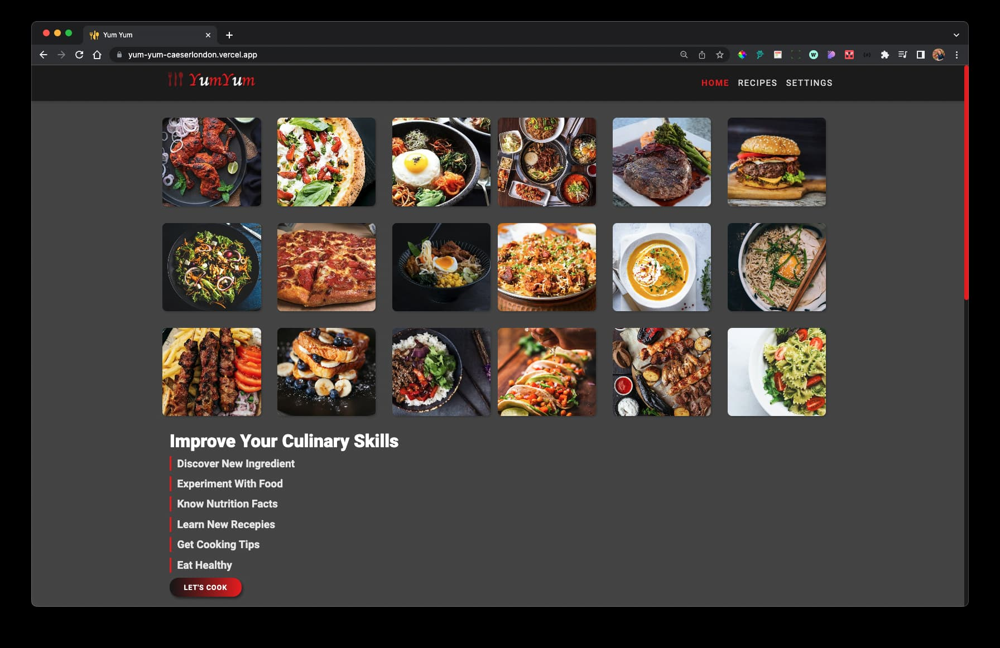

## Welcome to my GitHub profile

   

<h1  style="color:#ffd700" >Caeser Ibrahim</h1>

#### Personal Profile

I am a British full-stack web developer with a passion for developing apps and websites that focus on mobile-first design. I graduated from Makers Academy, an immersive 16-week full-stack software development Bootcamp, where I strengthened my coding knowledge. I’m friendly, confident, and always working on improving my skills and learning new technologies.

I have a passion for designing, debugging, and building dynamic, interactive websites. strengths in creativity, teamwork, and building projects from ideation to execution. I speak three languages fluently: English, Russian, and Arabic.

#### Education

● Makers Academy / London UK / Software Development Bootcamp (September 2021 - January 2022)

● Croydon College / London UK / ESOL and Functional Skills English (September 2004 - June 2005)

● University of Technology / Baghdad Iraq / Bachelor's degree in Architectural Engineering (BSc) (September 1993 - June 1998)

#### Work history

● Contract Freelance / London UK | Front End Web Developer (May 2022 - Present)

● QMQ Real Estate Inc / London UK | Front End Web Developer (May 2020 - July 2021)

● QMQ Real Estate Inc / London UK | Junior Web Developer (July 2019 - May 2020)

● Carfoosh Restaurant / Dubai UAE | Branch Manager (2016 - 2019)

● Freelance / London UK | Property manager (2012 - 2016)

● Magnolia Enterprise Limited / London UK | Owner and Designer (2008 - 2012)

#### Languages

**English** (full professional proficiency) , **Russian** (full professional proficiency) , **Arabic** (native proficiency)

**Nationality** / (Proudly British :uk: )

#### Hobbies

**● Acrylic and oil painting.**

**● Creating natural aquariums.**

#### Contact me

**Mobile**: **078 6886 3113**

**Email**: caeserlondon@gmail.com

     

### Technical Stack

     

 
 

<h1 align="center">Some Of My Projects</h1>
 <h4>Please leave a star, and feel free to fork or to clone.</h4>
<table>
  <tr>
    <td width="50%" valign="top">
      <h3 align="center">Yum Yum</h3>
         
        
         
        
Fully Responsive Recipe Website using Spoonacular API, With Multiple Themes, Made using React 18, React-router V6, Reacts hooks, React Icons and SASS.

      

       &nbsp; 
      

    </td>
   <td width="50%" valign="top">
      <h3 align="center">London Home Finder</h3>
         
        
         
        
For listings properties for rent and sale. Created using React V18.2.0 , react-router-dom V6.3.0 , react-leaflet for maps , Firebase(Backend-as-a-Service (Baas)) and react-toastify.

      

       &nbsp; 
      

    </td>
  </tr>
  
  <tr>
 <td width="50%" valign="top">
      <h3 align="center">Vet Clinic</h3>
         
        
         
        
Building a Vet clinic web site with Next V12.2 and React V18.2
Using stock photos and videos from  pexels.com

      

       &nbsp; 
      

    </td>
   <td width="50%" valign="top">
      <h3 align="center">GitHub Finder</h3>
         
        
         
        
Search and find Github users and view their profile, created with React V18.1 react-router V6.3, react-icons, TailWind and Daisy UI.

      

       &nbsp; 
      

    </td>
  </tr>
  <tr>
 <td width="50%" valign="top">
      <h3 align="center">Car Dealership</h3>
         
        
         
        
Building a fully responsive Classic Car Dealership website, using HTML, CSS and jQuery.

      

       &nbsp; 
      

    </td> <td width="50%" valign="top">
      <h3 align="center">Color-Picker</h3>
         
        
         
        
Create a random color palette. Control the hue, brightness and saturation.Save the color you like to the clipboard, Or and save the colors palette to the library.Created using JavaScript, Chroma.js, HTML5, CSS3 and font awesome.

      

       &nbsp; 
      

    </td>
  </tr>
</table>

## [🔝 Back to Top](#Welcome-to-my-GitHub-profile)
